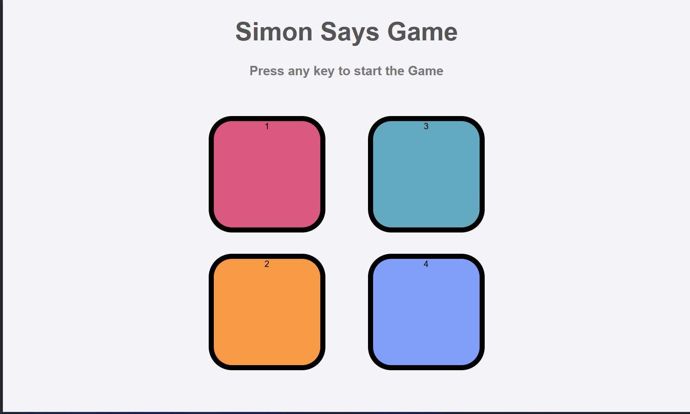

# Simon Game 🎮

A fun and interactive memory game built using **HTML**, **CSS**, and **JavaScript**. Test your memory by following an increasingly complex sequence of button flashes and colors. The game challenges you to recall and repeat the sequence as it grows with each level.

## Features ✨
- **Dynamic Gameplay**: Randomized color sequences that increase in complexity with each level.
- **Interactive UI**: Visually appealing buttons with smooth color transitions and effects.
- **Game Over Animation**: Visual feedback when the player makes a mistake.
- **Score Tracking**: Displays your score at the end of the game.

## How to Play 🕹️
1. Press any key to start the game.
2. Observe the sequence of flashing buttons.
3. Click the buttons in the same order as the sequence.
4. Progress through levels as the sequence grows.
5. If you make a mistake, the game ends, and your score is displayed.

## Technologies Used 💻
- **HTML**: Structure of the game.
- **CSS**: Styling for buttons and animations.
- **JavaScript**: Logic for game sequence, user input, and level progression.

## Game Preview 📷


## Installation 🚀
1. Clone the repository:
   ```bash
   git clone https://github.com/your-username/simon-says-game.git   
2. Open the index.html file in your web browser.

## File Structure
Simon-Game
├── index.html       # Main HTML file
├── style.css        # Styling for the game
├── script.js        # Game logic
├── README.md        # Documentation (this file)

## Contributing 🤝
Feel free to fork this repository and contribute. Pull requests are welcome!

## Enjoy playing the Simon Says Game! 😊
If you'd like to link an actual screenshot or want modifications, let me know!